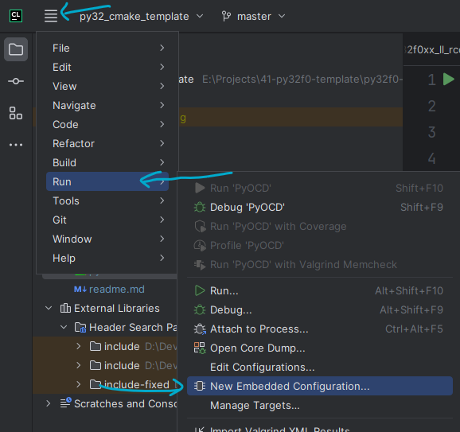
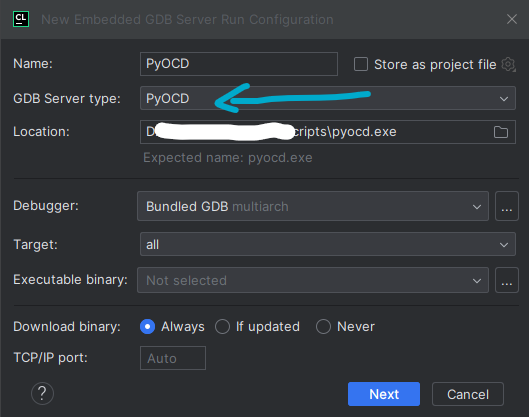
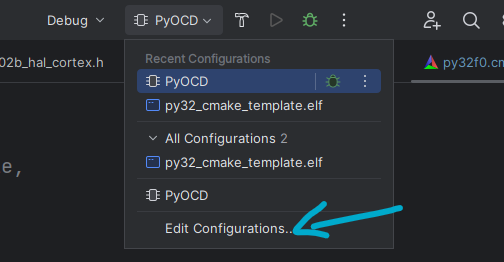
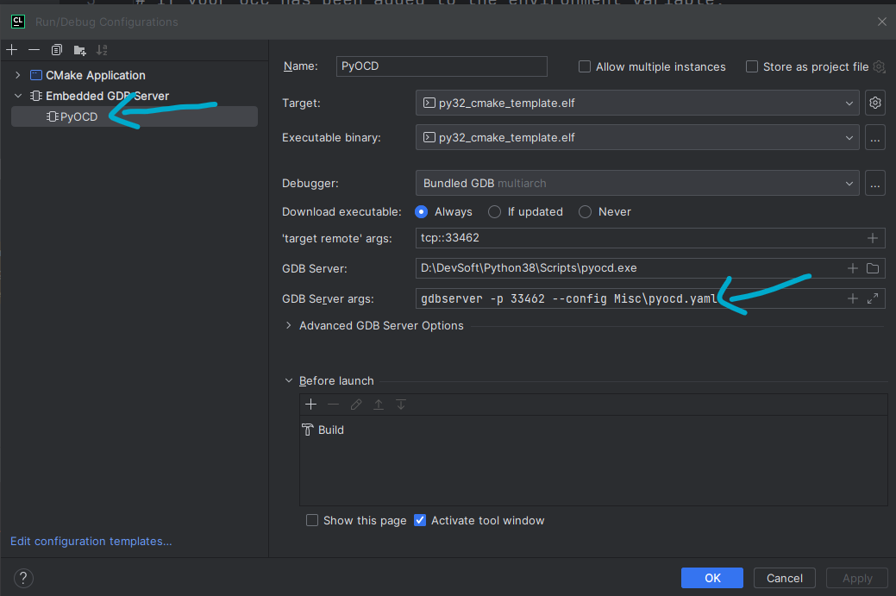

# Clion PyOCD Configure

Please download and install PyOCD first.





You can keep the default settings for now. Later on, we will configure the target ourselves.(Misc/pyocd.yaml)





```
gdbserver -p 33462 --config Misc\pyocd.yaml
```
