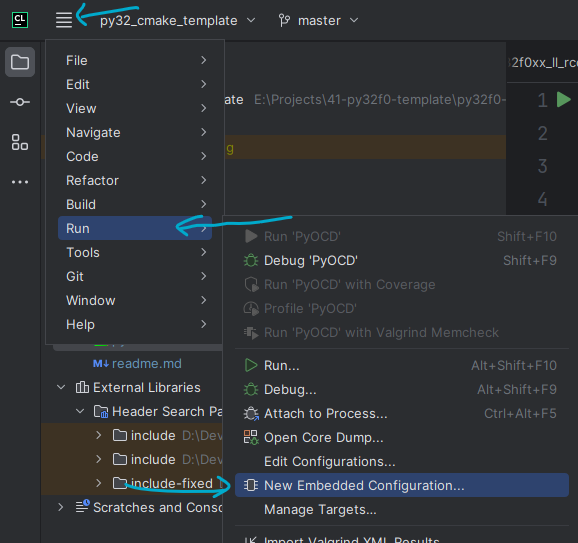
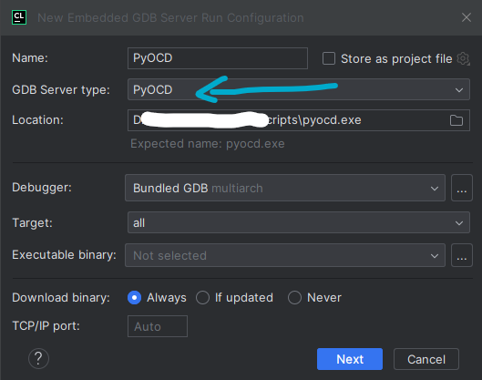
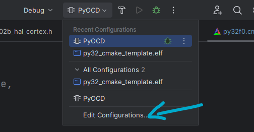
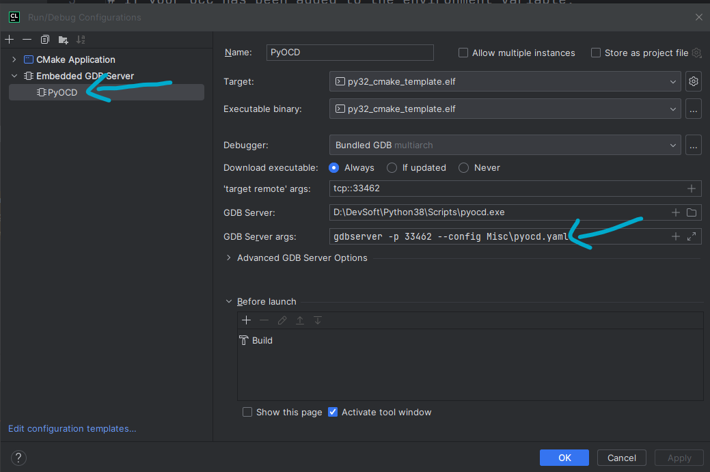
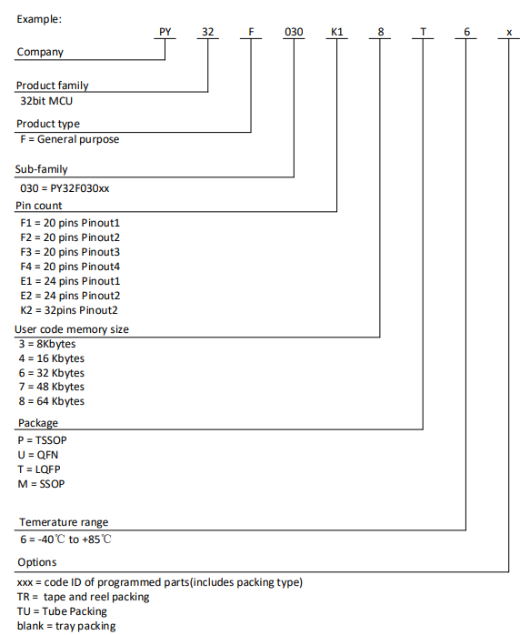

PY32F0 MCU CMake project template. Using GCC, cross-platform. You can use VSCode, CLion, etc. for development.

This project is in its early stage and may have many bugs or areas that are incomplete.

Most of the information for this project comes from Puya Semiconductor. Puya Semiconductor's information is in a semi-public state, and I have collected data such as chip manuals and libraries from various sources. Please refer to:

HAL, LL, CMSIS, BSP Drivers [decaday/PY32F0_Drivers](https://github.com/decaday/PY32F0_Drivers)

Datasheets, packs, reference manuals, etc. [decaday/PY32_Docs](https://github.com/decaday/PY32_Docs)

GCC startup and ldscript are from [IOsetting/py32f0-template](https://github.com/IOsetting/py32f0-template) (this repo uses makefile on Linux), thanks to the contributors to that project.

## Supported MCUs

### ---PY32F002B Series---

**Puya** PY32F002B

**Xinlinggo** XL32F001\*, XL32F002B\*

### ---PY32F0xx Series---

**Puya** PY32F002A, PY32F003, PY32F030

**Xinlinggo** XL32F003\*, XL32F002A\*

**Luat** AIR001

### ---PY32F07x Series---(TODO)

**Puya** PY32F040, PY32F071, PY32F072


*:Guessing based on chip specifications, haven’t tried it yet.

**:There are too many naming approaches for puya MCU, some MCUs such as PY32L020, PY32C613, etc. I didn't buy these chips, if you have them, please contribute relevant information. You can try above series with the same flash, ram, and clock speed, which may work because they are most likely produced from the same die.

## Steps

#### 1. Install gcc-arm-none-eabi

[Downloads | GNU Arm Embedded Toolchain Downloads – Arm Developer](https://developer.arm.com/downloads/-/gnu-rm)

Choose the appropriate package for your system and add `bin` to your environment variable (if you use the installer, it may have already been added automatically).

#### 2. Clone this template project

```
Copy Codegit clone --recursive https://github.com/decaday/py32f0_cmake_template.git
```

This repo has a submodule, so you need to add `--recursive`.

### 3. Edit the py32f0.cmake file.

```cmake
# project settings
set(CMAKE_CXX_STANDARD 17)
set(CMAKE_C_STANDARD 11)

# Use HAL lib or LL lib
set(USE_HAL_OR_LL LL)

# MCU:
#   PY32F002Ax5
#   PY32F002Bx5
#   PY32F003x4, PY32F003x6, PY32F003x8
#   PY32F030x4, PY32F030x6, PY32F030x7, PY32F030x8
set(MCU_MODEL PY32F030x6)

# Enable printf float %f support
set(ENABLE_PRINTF_FLOAT OFF)

# Build with CMSIS DSP functions
set(USE_DSP OFF)

# Enable auto generation of Misc/pyocd.yaml if needed
set(AUTO_GENERATE_PYOCD_YAML ON)
```

#### Set MCU_MODEL

Puya's MCU naming can be a bit cumbersome, for example, `PY32F002AF15P6TU`.

`PY32F002A` is the Product type, `F1` is the 20 pins Pinout1, `5` is 20 Kbytes of code, `P` is Package TSSOP, `6` is Temperature range 6 = -40 to +85, `TU` is Tube Packing.

Therefore, you need to choose PY32F002Ax5.

If you are using AIR001, you can choose PY32F030x6. If you are using XL32, please choose the appropriate settings based on the core and flash size.

#### AUTO_GENERATE_PYOCD_YAML

I have written a script in CMake to automatically generate `Misc/pyocd.yaml`. For more information about debugging, please see below.

### 4. Compilation

You can use IDEs like VSCode, CLion, or compile from the command line.

### 5. Debugging and Flashing

Puya has several ISP tools and official debuggers. You can find some information about them here: [decaday/PY32_Docs](https://github.com/decaday/PY32_Docs). However, in reality, we can use a regular DAPlink. I don't have STlink or Jlink, but contributions to the documentation are welcome.

I recommend using [PyOCD](https://pyocd.io/) as it supports MDK PACK.

Please download and install PyOCD.

#### Clion PyOCD Configure









```
gdbserver -p 33462 --config Misc\pyocd.yaml
```

#### VSCode Pyocd Configure

TODO


## Compilation Reference Size

| MCU   | Project       | RAM    | FLASH  |
| ----- | ------------- | ------ | ------ |
| F030  | HAL Blink     | 1584 B | 3860 B |
| F002B | HAL Blink     | 816B   | 3280 B |
| F030  | LL Toggle Pin | 1568B  | 1156 B |
|       |               |        |        |

## Puya Naming Instructions




| code | Flash memory |
| ---- | ------------ |
| 3    | 8 Kbytes     |
| 4    | 16 Kbytes    |
| 5    | 20/24 Kbytes |
| 6    | 32 Kbytes    |
| 8    | 64 Kbytes    |
| 9    | 96 Kbytes    |
| B    | 128 Kbytes   |

